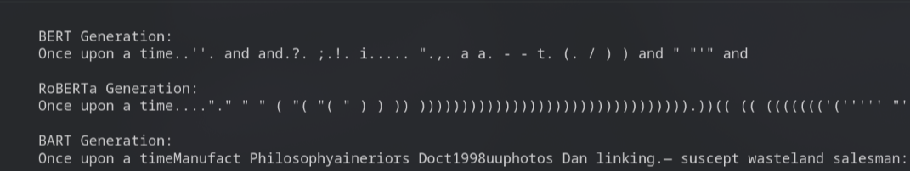
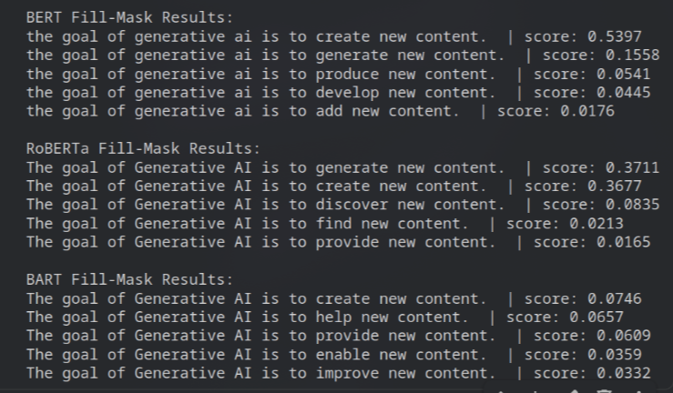
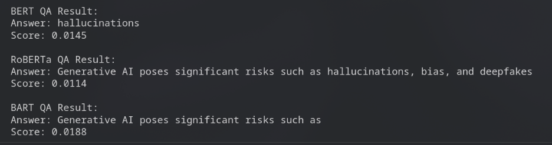

### Models used
1.  **BERT** (`bert-base-uncased`): An **Encoder-only** model (designed for understanding, not generation).
2.  **RoBERTa** (`roberta-base`): An optimized **Encoder-only** model.
3.  **BART** (`facebook/bart-base`): An **Encoder-Decoder** model (designed for seq2seq tasks like translation/generation).

---

### Experiment 1: Text Generation
**Task**: Try to generate text using the prompt: `"The future of Artificial Intelligence is"`
*   **Code Hint**: `pipeline('text-generation', model='...')`
*   **Hypothesis**: Which models will fail? Why? (Hint: Can an Encoder *generate* new tokens easily?)

### Observations of experiment 1

### Experiment 2: Masked Language Modeling (Missing Word)
**Task**: Predict the missing word in: `"The goal of Generative AI is to [MASK] new content."`
### observations exp 2

### Experiment 3: Question Answering
**Task**: Answer the question `"What are the risks?"` based on the context: `"Generative AI poses significant risks such as hallucinations, bias, and deepfakes."`
### observations exp 3

---

### Deliverable: Observation Table

Copy this markdown table into your notebook and fill it out based on your experiments.

| Task | Model | Classification (Success/Failure) | Observation (What actually happened?) | Why did this happen? (Architectural Reason) |
| :--- | :--- | :--- | :--- | :--- |
| **Generation** | **BERT** | Failure | Output was mostly punctuation, repeated words like “and”, and broken fragments instead of a meaningful sentence. | BERT is an **encoder-only** model trained with Masked Language Modeling. It does not learn left-to-right token prediction, so it cannot perform autoregressive text generation. |
| | **RoBERTa** | Failure | Produced repetitive symbols, quotes, and parentheses with no meaningful continuation. | RoBERTa is also **encoder-only**. Even though it’s optimized over BERT, it still lacks a decoder and was never trained to generate sequences token by token. |
| | **BART** | Partial Failure | Generated real words but in a chaotic, nonsensical sequence (random topics, names, broken structure). | BART has an **encoder–decoder**, so it *can* generate text. However, `bart-base` is trained mainly for **denoising and seq2seq tasks**, not open-ended story continuation, leading to unstable free-form generation. |
| **Fill-Mask** | **BERT** | Success | Predicted highly relevant words like *create, generate, produce* with strong confidence scores. | BERT was **explicitly trained** on the Masked Language Modeling objective, so predicting missing words is its primary strength. |
| | **RoBERTa** | Success | Very accurate predictions similar to BERT, with *generate* and *create* as top outputs. | RoBERTa improves BERT’s MLM training with more data and longer training, making it strong at contextual word prediction. |
| | **BART** | Partial Success | Predicted reasonable but less precise words like *create, help, provide*. Confidence scores were lower. | BART was not trained primarily for MLM. Its objective was **denoising corrupted text**, so token-level mask prediction is not its main specialization. |
| **QA** | **BERT** | Partial Success | Extracted the word *“hallucinations”* as the answer, but missed the full list of risks. Very low confidence score. | Base BERT understands context but is **not fine-tuned for extractive QA**, so it struggles to select full answer spans. |
| | **RoBERTa** | Partial Success | Returned almost the entire sentence from the context instead of a concise span. | Without QA fine-tuning, RoBERTa cannot precisely predict answer boundaries, even though it understands the passage. |
| | **BART** | Partial Success | Output a partial phrase: *“Generative AI poses significant risks such as”* without completing the list. | BART is generative and not optimized for **extractive span selection**, so it struggles with pinpointing exact answer spans in QA tasks. |

---